# 🔮 Oracle Knowledge Graph

> Auto-generated: 2025-12-26 06:00
> Total Documents: 88

## 📊 Graph Visualization

```mermaid
graph TD
    subgraph Memory
        TIMELINE[📅 Timeline]
        LEARNINGS[📚 Learnings]
        RESONANCE[🎯 Resonance]
    end
    
    subgraph Agents
        BRAIN[🧠 Brain]
        CODEX[💻 Codex]
        ASK[☁️ Ask/GLM]
    end
    
    subgraph Oracle
        SPAWN[🔮 Oracle Spawn]
        MAW[🔀 MAW]
    end
    
    SPAWN --> BRAIN
    SPAWN --> CODEX
    SPAWN --> ASK
    
    BRAIN --> LEARNINGS
    CODEX --> LEARNINGS
    
    MAW --> TIMELINE
    MAW --> RESONANCE
    
    RESONANCE --> |identity| BRAIN
    TIMELINE --> |history| SPAWN
```

## 📂 Document Index

### Memory Documents
- [gemma_vs_qwen_20251221_0127.md](memory/benchmarks/gemma_vs_qwen_20251221_0127.md)
- [sync_report.md](memory/codex_sync/sync_report.md)
- [2025-12-18_03-32_session.md](memory/learnings/2025-12-18_03-32_session.md)
- [2025-12-18_06-21_oracle_spawn.md](memory/learnings/2025-12-18_06-21_oracle_spawn.md)
- [2025-12-18_06-24_oracle_spawn.md](memory/learnings/2025-12-18_06-24_oracle_spawn.md)
- [2025-12-18_07-59_oracle_spawn.md](memory/learnings/2025-12-18_07-59_oracle_spawn.md)
- [2025-12-18_daily_lesson.md](memory/learnings/2025-12-18_daily_lesson.md)
- [2025-12-18_soul-brews-complete-summary.md](memory/learnings/2025-12-18_soul-brews-complete-summary.md)
- [2025-12-19_11-52_oracle_spawn.md](memory/learnings/2025-12-19_11-52_oracle_spawn.md)
- [2025-12-19_oracle_lesson.md](memory/learnings/2025-12-19_oracle_lesson.md)
- [2025-12-20_gemma_upgrade.md](memory/learnings/2025-12-20_gemma_upgrade.md)
- [2025-12-20_oracle_lesson.md](memory/learnings/2025-12-20_oracle_lesson.md)
- [2025-12-20_peer_lesson_32b.md](memory/learnings/2025-12-20_peer_lesson_32b.md)
- [2025-12-20_self_learning.md](memory/learnings/2025-12-20_self_learning.md)
- [2025-12-21_oracle_lesson.md](memory/learnings/2025-12-21_oracle_lesson.md)
- [2025-12-21_peer_lesson_32b.md](memory/learnings/2025-12-21_peer_lesson_32b.md)
- [2025-12-21_self_learning.md](memory/learnings/2025-12-21_self_learning.md)
- [2025-12-22_oracle_lesson.md](memory/learnings/2025-12-22_oracle_lesson.md)
- [2025-12-22_peer_lesson_32b.md](memory/learnings/2025-12-22_peer_lesson_32b.md)
- [2025-12-22_self_learning.md](memory/learnings/2025-12-22_self_learning.md)
- [2025-12-23_oracle_lesson.md](memory/learnings/2025-12-23_oracle_lesson.md)
- [2025-12-23_peer_lesson_32b.md](memory/learnings/2025-12-23_peer_lesson_32b.md)
- [2025-12-23_self_learning.md](memory/learnings/2025-12-23_self_learning.md)
- [2025-12-24_oracle_lesson.md](memory/learnings/2025-12-24_oracle_lesson.md)
- [2025-12-24_peer_lesson_32b.md](memory/learnings/2025-12-24_peer_lesson_32b.md)
- [2025-12-24_self_learning.md](memory/learnings/2025-12-24_self_learning.md)
- [2025-12-25_oracle_lesson.md](memory/learnings/2025-12-25_oracle_lesson.md)
- [2025-12-25_peer_lesson_32b.md](memory/learnings/2025-12-25_peer_lesson_32b.md)
- [2025-12-25_self_learning.md](memory/learnings/2025-12-25_self_learning.md)
- [2025-12-26_oracle_lesson.md](memory/learnings/2025-12-26_oracle_lesson.md)
- [2025-12-26_peer_lesson_32b.md](memory/learnings/2025-12-26_peer_lesson_32b.md)
- [2025-12-26_self_learning.md](memory/learnings/2025-12-26_self_learning.md)
- [daily_progress.md](memory/learnings/daily_progress.md)
- [SYSTEM_COMPARISON.md](memory/learnings/SYSTEM_COMPARISON.md)
- [2025-12-18_02-53_soul-brews-studio-integration-.md](memory/logs/2025-12-18_02-53_soul-brews-studio-integration-.md)
- [2025-12-18_03-02_maw-integration-completed-on-l.md](memory/logs/2025-12-18_03-02_maw-integration-completed-on-l.md)
- [2025-12-18_03-09_completed-reading-all-soul-bre.md](memory/logs/2025-12-18_03-09_completed-reading-all-soul-bre.md)
- [2025-12-18_03-55.md](memory/logs/2025-12-18_03-55.md)
- [2025-12-18_04-09.md](memory/logs/2025-12-18_04-09.md)
- [2025-12-18_05-18.md](memory/logs/2025-12-18_05-18.md)
- [2025-12-18_05-20.md](memory/logs/2025-12-18_05-20.md)
- [2025-12-19_02-00.md](memory/logs/2025-12-19_02-00.md)
- [2025-12-19_03-03.md](memory/logs/2025-12-19_03-03.md)
- [2025-12-19_03-05.md](memory/logs/2025-12-19_03-05.md)
- [2025-12-19_04-00.md](memory/logs/2025-12-19_04-00.md)
- [2025-12-19_05-00.md](memory/logs/2025-12-19_05-00.md)
- [32b_monitor_20251219_132203.md](memory/logs/32b_monitor_20251219_132203.md)
- [SIMULATION_REPORT.md](memory/logs/SIMULATION_REPORT.md)
- [snapshot_20251220_0200.md](memory/logs/snapshot_20251220_0200.md)
- [snapshot_20251220_0401.md](memory/logs/snapshot_20251220_0401.md)
- [snapshot_20251220_0500.md](memory/logs/snapshot_20251220_0500.md)
- [snapshot_20251221_0200.md](memory/logs/snapshot_20251221_0200.md)
- [snapshot_20251221_0400.md](memory/logs/snapshot_20251221_0400.md)
- [snapshot_20251221_0500.md](memory/logs/snapshot_20251221_0500.md)
- [snapshot_20251222_0200.md](memory/logs/snapshot_20251222_0200.md)
- [snapshot_20251222_0400.md](memory/logs/snapshot_20251222_0400.md)
- [snapshot_20251222_0500.md](memory/logs/snapshot_20251222_0500.md)
- [snapshot_20251223_0200.md](memory/logs/snapshot_20251223_0200.md)
- [snapshot_20251223_0411.md](memory/logs/snapshot_20251223_0411.md)
- [snapshot_20251223_0500.md](memory/logs/snapshot_20251223_0500.md)
- [snapshot_20251224_0200.md](memory/logs/snapshot_20251224_0200.md)
- [snapshot_20251224_0500.md](memory/logs/snapshot_20251224_0500.md)
- [snapshot_20251224_1110.md](memory/logs/snapshot_20251224_1110.md)
- [snapshot_20251225_0200.md](memory/logs/snapshot_20251225_0200.md)
- [snapshot_20251225_0500.md](memory/logs/snapshot_20251225_0500.md)
- [snapshot_20251225_2102.md](memory/logs/snapshot_20251225_2102.md)
- [snapshot_20251226_0200.md](memory/logs/snapshot_20251226_0200.md)
- [snapshot_20251226_0400.md](memory/logs/snapshot_20251226_0400.md)
- [snapshot_20251226_0500.md](memory/logs/snapshot_20251226_0500.md)
- [AI_NO1_ROLE.md](memory/resonance/AI_NO1_ROLE.md)
- [AI_TOOLS_AVAILABLE.md](memory/resonance/AI_TOOLS_AVAILABLE.md)
- [KNOWLEDGE_SOURCES.md](memory/resonance/KNOWLEDGE_SOURCES.md)
- [ORACLE_PHILOSOPHY.md](memory/resonance/ORACLE_PHILOSOPHY.md)
- [SAFETY_RULES.md](memory/resonance/SAFETY_RULES.md)
- [SERVER_ARCHITECTURE.md](memory/resonance/SERVER_ARCHITECTURE.md)
- [SYSTEM_IDENTITY.md](memory/resonance/SYSTEM_IDENTITY.md)
- [TOOLS_AND_SERVICES.md](memory/resonance/TOOLS_AND_SERVICES.md)
- [2025-12-18_04-33.md](memory/retrospectives/2025-12-18_04-33.md)
- [2025-12-18_05-19.md](memory/retrospectives/2025-12-18_05-19.md)

### Root Documents
- [HOME.md](HOME.md)
- [KNOWLEDGE_GRAPH.md](KNOWLEDGE_GRAPH.md)
