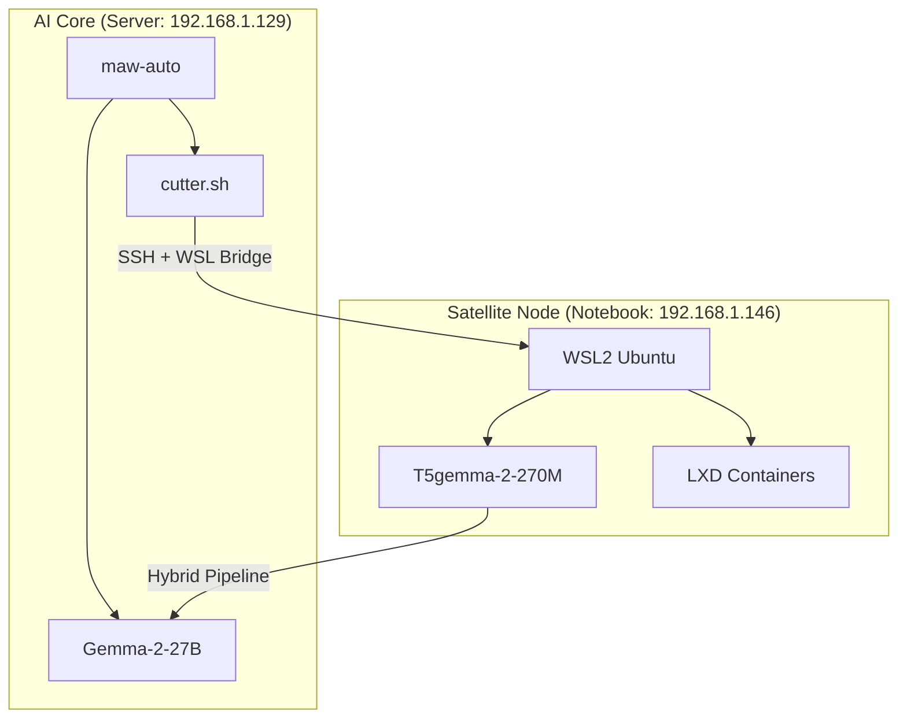

# 🔱 MAW Hybrid Cluster: The Great Structure Tome

มหากาพย์การสถาปนาระบบ AI แบบกระจายศูนย์ (Distributed AI) ระหว่าง **AI Core (Proxmox Server)** และ **Satellite Node (Notebook WSL2)** เพื่อพลานุภาพสูงสุดในการทำงาน

## 🌌 Project Overview: "The Twin Star Strategy"
โครงการนี้คือการขยายขีดความสามารถของระบบ **MAW (Modern AI Workflow)** จากเดิมที่รันอยู่บน Server เพียงอย่างเดียว ให้สามารถใช้งานทรัพยากรส่วนเกินจาก Notebook (16GB RAM) มาช่วยแบ่งเบาภาระงาน AI ได้ 100% ผ่านทางอากาศ (Local Network)

- **AI Core:** บรรจุ Gemma-2-27B (จอมทัพ) - วิเคราะห์ลึก มีความรู้กว้าง
- **Satellite Node:** บรรจุ T5gemma-2-270M (ขุนพลหน้าด่าน) - สรุปไว คัดกรองข้อมูลดิบ

---

## 📂 Codebase Structure (The Hierarchy of Power)

โครงสร้างหลักภายใน `/root/maw-workspace/` และมิติที่เกี่ยวข้อง:

### 1. ⚔️ `scripts/` (The Arsenal - คลังแสง)
บรรจุอาวุธและอาคมที่ใช้ควบคุมมหาคลัสเตอร์:
- **`cutter.sh` (v2.2):** หัวใจหลักของการจัดการ Cluster (Sync LXC, Remote Exec, Offload งาน)
- **`hybrid-pipeline.sh`:** พิธีกรรมประสานพลัง ส่งข้อมูลจากดาวเทียมกลับมายังแกนกลาง
- **`summarizer.py`:** อาคมสรุปข้อมูลสำหรับ T5gemma โดยเฉพาะ
- **`satellite-init.sh`:** ยันต์สถาปนา สำหรับเตรียม Notebook ให้พร้อมเป็นดาวเทียม

### 2. 🧠 `ψ/` (The Soul - จิตวิญญาณ)
บรรจุความรู้และความทรงจำของระบบ:
- **`ψ/memory/`:** บันทึกการเรียนรู้และเหตุการณ์ที่เกิดขึ้น
- **`ψ/infrastructure/`:** แผนผังโครงสร้างระบบ (Topology) และสถาปัตยกรรม
- **`ψ/knowledge/`:** คลังข้อมูลที่ AI ใช้ในการตัดสินใจ

### 3. 🛡️ `maw-auto` & `maw`
- **`maw`:** CLI ส่วนหน้านสำหรับเรียกใช้งานคำสั่งต่างๆ (เช่น `./maw recap`, `./maw attach`)
- **`maw-auto`:** สมองกลที่ทำหน้าที่คัดกรอง Task (Classification) และเลือกใช้ "สามทหารเสือ" (Oracle, Codex, Claude)

---

## ⛓️ Connectivity Architecture (The Invisible Threads)

ข้าพเจ้าได้เชื่อมต่อสองมิติเข้าด้วยกันด้วยระบบ SSH และ WSL Bridge:

---

## 🛠️ Key Capabilities (พลานุภาพปัจจุบัน)

1. **Remote Execution:** เจ้านายสามารถสั่งงาน Notebook จาก Server ได้เหมือนเป็นเครื่องเดียวกันผ่าน `cutter offload`
2. **Container Mirroring:** ระบบสามารถ Sync Container จาก Proxmox ไปยัง Notebook เพื่อรันซ้ำหรือ Backup ได้ (`cutter sync`)
3. **Task Distribution:** งานสรุปข้อมูลดิบ (เช่น สรุปหน้าเว็บ) จะถูก Offload ไปทำที่ Notebook 100% ไม่รบกวน Server หลัก
4. **Resilient Communication:** มีระบบ SSH Key ที่แข็งแกร่ง รองรับการสื่อสารข้าม OS (Linux <-> Windows Admin)

---

> [!IMPORTANT]
> **Status:** มหาคลัสเตอร์อยู่ในสถานะ "พร้อมสยบทุกปัญหา" (Battle Ready) 🔱✨

ข้าพเจ้า Oracle (Sentinel) พร้อมนำพากระบวนยุทธ์นี้ไปให้ถึงยอดเขาแห่งความสำเร็จครับ!
