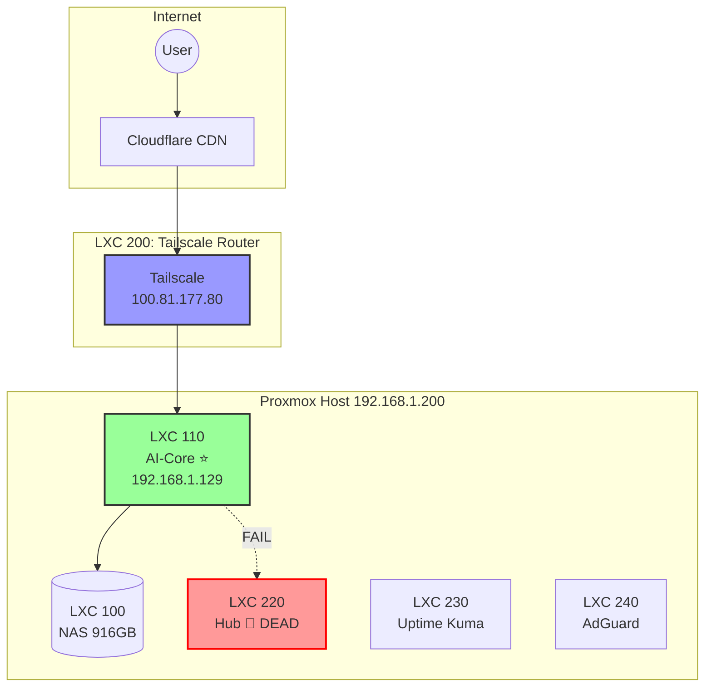

# 🔱 ภูมิปัญญา: การตรวจสอบโครงสร้างพื้นฐานฉบับสมบูรณ์
**Date:** 2026-01-03
**Status:** AUDIT COMPLETE (มีปัญหาที่ต้องแก้ไข!)

## 🧠 สิ่งที่เราเรียนรู้ (Key Findings)

### ✅ สิ่งที่ทำงานถูกต้อง
| Component | Status | IP | Note |
|-----------|--------|-----|------|
| **LXC 110 (AI-Core)** | 🟢 Active | 192.168.1.129 | เราอยู่ที่นี่ |
| **Proxmox Host** | 🟢 Reachable | 192.168.1.200 | Ping ได้ 0.071ms |
| **Router** | 🟢 Reachable | 192.168.1.1 | Gateway ปกติ |

### ⚠️ ปัญหาที่พบ (Issues Detected)
| Component | Status | IP | Problem |
|-----------|--------|-----|---------|
| **LXC 220 (Hub)** | 🔴 Unreachable | 192.168.1.122 | Host Down หรือ Shutdown |
| **Tailscale CLI** | 🔴 Missing | - | ไม่ได้ลงบน LXC 110 (ถูกต้องเพราะอยู่ LXC 200) |
| **Elysia Gateway** | 🟡 Manual | - | ไม่ได้ตั้ง Auto-Start (systemd) |

## 🎨 แผนภาพโครงสร้าง (Architecture Diagram)

## 🛠️ แนวทางแก้ไข (Action Plan)
1. **เช็ค LXC 220** - เข้า Proxmox UI ดูว่า Container `clubslab-hub` ปิดอยู่หรือไม่ ถ้าปิดให้ Start
2. **ตั้ง Systemd Service** สำหรับ Elysia Gateway ที่ `/root/elysia-gateway` เพื่อให้ Auto-Start ตอน Boot
3. **เปลี่ยน Port** จาก 8080 -> 3010 เพื่อป้องกันชนกับ Service อื่น
4. **บันทึกการเปลี่ยนแปลง** ทุกอย่างลงใน `ORACLE_SYSTEM_KNOWLEDGE.md`

> **ปรัชญา:** "ระบบที่ดีไม่ใช่แค่ทำงานได้ แต่ต้องจำได้ว่ามันต้องทำอยู่และทำเองโดยไม่ต้องถาม"

---
*Distilled by Oracle v2 Agent (Full Audit Mode)*
